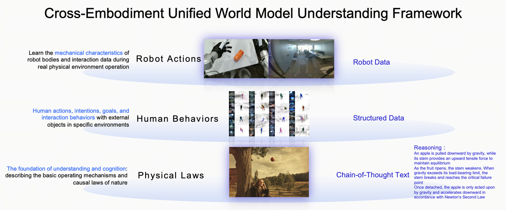
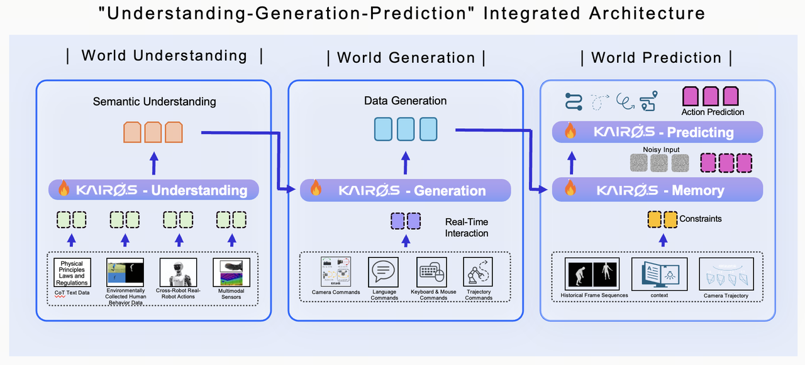
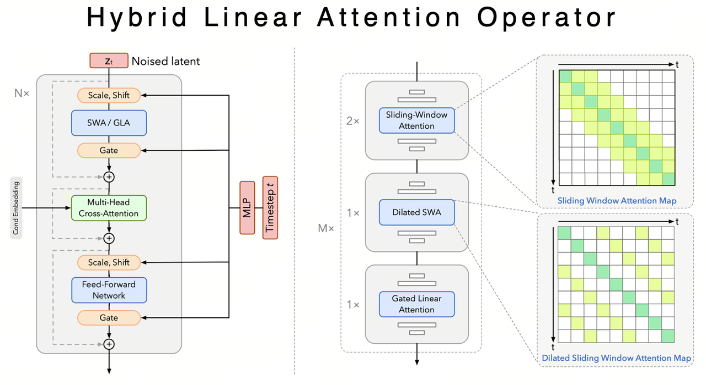

# Kairos 3.0

<p align="center">
    
<p>

<p align="center">
    💜 <a href="https://kairos.acerobotics.com">Kairos Platform</a> &nbsp&nbsp ｜ &nbsp&nbsp 🖥️ <a href="https://github.com/kairos-agi">GitHub</a> &nbsp&nbsp  | &nbsp&nbsp🤗 <a href="https://huggingface.co/kairos-agi">Hugging Face</a>&nbsp&nbsp | &nbsp&nbsp 📑 <a href="">Paper</a> &nbsp&nbsp 

-----
**Kairos 3.0** is grounded in physical laws as its cognitive foundation, establishing a unified cross-embodiment world modeling framework. Featuring a 4B-parameter architecture with a custom hybrid linear attention operator, it unifies multimodal understanding, generation, and action prediction for real-time edge deployment. By achieving physics-level deep cognition and low-latency inference, it empowers high-precision action prediction and HD generation for both physical and digital embodied AI applications.

## 🎯 1. Motivation
While Scaling Laws are emerging in Embodied AI, their efficiency is severely bottlenecked by data heterogeneity, poor long-horizon reasoning, and edge-side compute constraints. These hurdles make scaling alone insufficient for reliable interaction, hindering the path to industrial-grade General Embodied Intelligence.

## 🌟  2. Kairos 3.0  Framework

<div align="center">
<table align="center">
    <tr>
        <td align="center"></td>
        <td align="center"></td>
        <td align="center"></td>
    </tr>
</table>
</div>

### 🌍 Unified World Modeling Framework
Kairos 3.0 uses fundamental physical and causal laws as its cognitive foundation. By integrating real-robot interaction, structured human behavior, and Chain-of-Thought (CoT) data, it breaks heterogeneity barriers and boosts data reuse efficiency. This shifts the paradigm from simple imitation to physics-level deep understanding, enabling robust generalization and long-horizon reasoning at a more efficient model scale.

### 🔗 Integrated Multimodal Architecture
Designed as a unified end-to-end pipeline for Understanding, Generating, and Predicting the world. Leveraging physical laws and causal CoT, the model doesn't just "see" but "understands" the underlying logic of environments. This allows for precise decomposition of complex tasks, seamless planning, and reliable execution in a single intelligence loop.

### ⚡ Linear-Time Attention for World Models
Introducing the first Hybrid Linear Attention operator specifically for world models. By reducing temporal complexity from $O(n^2)$ to $O(n)$, Kairos 3.0 slashes VRAM and compute overhead while maintaining long-sequence capabilities. This enables the industry’s first real-time on-robot inference for an open-source world model.

## ✨ 3. Demos
<div align="center">
<table style="text-align: center; margin: 0 auto;">
    <thead>
        <tr>
            <th style="text-align: center;">Physical–causal consistency</th>
            <th style="text-align: center;">Cross-embodiment generalization</th>
            <th style="text-align: center;">High-efficiency inference</th>
        </tr>
    </thead>
    <tbody>
        <tr>
            <td style="text-align: center;"><video src="https://github.com/user-attachments/assets/37f39f59-51c0-4cc5-af65-bf30c2a26145" width="240" controls muted loop></video></td>
            <td style="text-align: center;"><video src="https://github.com/user-attachments/assets/e67d3c86-8b00-4813-ab0f-15b375a59cc4" width="240" controls muted loop></video></td>
            <td style="text-align: center;" rowspan="3"><video src="https://github.com/user-attachments/assets/b1cbd67b-d912-48bc-8062-51aa1afd3465" width="240" controls muted loop></video></td>
        </tr>
        <tr>
            <td style="text-align: center;"><video src="https://github.com/user-attachments/assets/98531018-8ab1-4a6d-8be2-63994dfc7dde" width="240" controls muted loop></video></td>
            <td style="text-align: center;"><video src="https://github.com/user-attachments/assets/fdade592-4ade-4c90-b2c0-7877b95f6abe" width="240" controls muted loop></video></td>
        </tr>
        <tr>
            <td style="text-align: center;"><video src="https://github.com/user-attachments/assets/a9978820-f77c-46d2-8481-2b5bce2177ad" width="240" controls muted loop></video></td>
            <td style="text-align: center;"><video src="https://github.com/user-attachments/assets/768e39de-ce38-4431-8395-e07ba6df7475" width="240" controls muted loop></video></td>
        </tr>
    </tbody>
</table>
</div>

### 🧠 Physical–causal consistency
Kairos leverages causal CoT and physical laws to transform multimodal inputs into deep task logic. It enables autonomous planning and feasibility analysis, shifting the system from "executing commands" to "understanding intent" for real-world robotic actions.
### 🎨 Cross-embodiment generalization
Unified Cross-Embodied Generation: A single "brain" that generalizes across single-arm, dual-arm, and dexterous-hand platforms. Kairos enables shared, transferable world knowledge with maximal adaptability. Broad Hardware Support: Native compatibility with Agibot G1, Unitree G1, and Songling PIPER, significantly slashing development costs through zero-shot multi-task generalization.
### 🔮 High-efficiency inference
Real-time Edge Performance: Industry-leading inference speed with ultra-low resource consumption. Optimized for low-latency, high-reliability deployment across single or multi-GPU embodied systems.

## 📦 4. Model Zoo
| Model Version | Resolution | Use cases | Highlights |
|:---:|:---:|:---:|:---:|
| [kairos-4B 480p](https://huggingface.co/kairos-agi/kairos-sensenova-common/blob/main/models/kairos-common-4B-480P-16fps.safetensors) | 480P | 480p general pretrained model | 480p pretrained model for downstream fine-tuning. |
| [kairos-4B-robot 480p](https://huggingface.co/kairos-agi/kairos-sensenova-robot/blob/main/models/kairos-robot-4B-480P-16fps.safetensors) | 480P | Robot manipulation & real-world closed-loop control | Specialized for embodied AI; leading accuracy on PAI-Bench |
| [kairos-4B-robot 480p distillation](https://huggingface.co/kairos-agi/kairos-sensenova-robot/blob/main/models/kairos-robot-4B-480P-16fps-distilled.safetensors) | 480P | On-robot Integration、Edge Computing、Low-power Efficiency | Ultra-lightweight via distillation; enables real-time inference on embedded/edge devices. |
| [kairos-4B 720p](https://huggingface.co/kairos-agi/kairos-sensenova-common/blob/main/models/kairos-common-4B-720P-16fps.safetensors) | 720P | HD visual generation & complex physical reasoning | Supports 720P HD output with enhanced fine-grained detail capture. |

## 📈5. Evaluation 
### 🎯 5.1 Accuracy Benchmarks

<div align="center">
<table align="center">
    <thead>
        <tr>
            <th align="center">Domain</th>
            <th align="center">Benchmarks</th>
            <th align="center">Kairos-Robot</th>
            <th align="center">Cosmos 2.5-2B*</th>
            <th align="center">Wan 2.2-5B*</th>
            <th align="center">Cosmos 2.5-14B*</th>
            <th align="center">Lingbot*</th>
        </tr>
    </thead>
    <tbody>
        <tr>
            <td align="center" rowspan="3">Robot</td>
            <td align="center">PAI-Bench-robot</td>
            <td align="center">80.03</td>
            <td align="center">78.3</td>
            <td align="center">78.6</td>
            <td align="center">79.4</td>
            <td align="center">79.96</td>
        </tr>
        <tr>
            <td align="center">WorldModelBench-robot TI2V</td>
            <td align="center">9.08</td>
            <td align="center">9.04</td>
            <td align="center">8.52</td>
            <td align="center">8.94</td>
            <td align="center">9.04</td>
        </tr>
        <tr>
            <td align="center">DreamGen Bench(PA/IF)</td>
            <td align="center">0.529/0.609</td>
            <td align="center">0.418/0.568</td>
            <td align="center">0.314/0.543</td>
            <td align="center">0.495/0.478</td>
            <td align="center">0.466/0.569</td>
        </tr>
    </tbody>
</table>
</div>

<div align="center">
<table align="center">
    <thead>
        <tr>
            <th align="center">Domain</th>
            <th align="center">Benchmarks</th>
            <th align="center">Kairos 3.0-4B</th>
            <th align="center">Cosmos 2.5-2B*</th>
            <th align="center">Wan 2.2-5B*</th>
            <th align="center">Cosmos 2.5-14B</th>
        </tr>
    </thead>
    <tbody>
        <tr>
            <td align="center" rowspan="3">General</td>
            <td align="center">PAI-Bench</td>
            <td align="center">80.84</td>
            <td align="center">81.0</td>
            <td align="center">80.4</td>
            <td align="center">81.0</td>
        </tr>
        <tr>
            <td align="center">WorldModelBench</td>
            <td align="center">8.94</td>
            <td align="center">8.86</td>
            <td align="center">8.70</td>
            <td align="center">9.02*</td>
        </tr>
        <tr>
            <td align="center">VideoPHY</td>
            <td align="center">45.55</td>
            <td align="center">44.64</td>
            <td align="center">38.85</td>
            <td align="center">-</td>
        </tr>
    </tbody>
</table>
</div>

*（results reproduced from open-source model baselines, "robot" refers to the corresponding results of the robot subset.）

Kairos models deliver SOTA performance across diverse benchmarks. In embodied scenarios, Kairos-Robot leads PAI-Bench with a score of 80.08 and dominates generalization tasks in DreamGen Bench. For general world modeling, Kairos 3.0-4B matches or exceeds larger-scale models on WorldModelBench and VideoPHY, achieving a perfect balance of precision and efficiency at a compact 4B scale.

### ⚡ 5.2 Deployment
#### 5.2.1 Real-time Inference

| GPU | Resulotion | Memory(GB) | 1 GPU (s) | 4 GPUs (s) |
|:---:|:---:|:---:|:---:|:---:|
| NV-A800 | 480P | 23.5 | 11.7 | 3.0 |
| NV-RTX5090 | 480P | 13.9 | 11.4 | 5.7 |
| MetaX-C500 | 480P | 22.9 | 18.8 | 4.7 |

*（results based on kairos-4B-robot 480p distillation）

#### 5.2.2 Benchmark for A800 GPU


| Model | Parameter | Memory (GB) | Complexity (PFlops) | 1 GPU (s) | 4 GPUs (s) |
|:---:|:---:|:---:|:---:|:---:|:---:|
| Kairos 3.0 | 4B | 23.5 | 2.3 | 43.3 | 9.5 |
| Cosmos 2.5 | 14B | 70.2 | 156.5 (~70x) | 2526.0 | 687.2 |
| Wan 2.2 | 5B | 23.4 | 16.6 (~7x) | 201.0 | 85.0 |
| Lingbot | 28B | 46.1 | 347.4 (~160x) | 5525.0 | 1436.0 |

*（evaluation setting：TI2V mode with 720P/5s）

## 🔧 6. Quick Start
### 6.1 Environment Installation

```bash
# Clone the repository
git clone https://github.com/kairos-agi/kairos-sensenova.git
cd kairos-sensenova

# You can set up the environment in two ways:
# 1) Build container from the Docker image
# 2) Build the environment from requirements with conda or venv

# 1) Docker image:
# Pull the Docker image
echo ghp_xxxxxxxxxxxxxxxxx | docker login ghcr.io -u username --password-stdin
docker pull ghcr.io/kairos-agi/kairos-sensenova:v0.0.1

# Create a container using Docker
docker run --rm -it \
  --gpus all \
  -v $(pwd):/workspace \
  ghcr.io/kairos-agi/kairos-sensenova:v0.0.1 \
  bash


# 2) requirments
# build a python environment with python>=3.10 && torch>=2.6 && cuda>=12.6
# install requirements
pip install -r requirements.txt
```

### 6.2 Run Inference
```bash
# Step1: Fetch the Model
pip install -U huggingface_hub 
mkdir -p models/Kairos-model models/Qwen models/Wan2.1-T2V-14B

# Download kairos model
hf download kairos-agi/kairos-sensenova-common \
  --local-dir models/Kairos-model \
  --local-dir-use-symlinks False
  
# Download Qwen2.5-VL for Text-Encoder
hf download Qwen/Qwen2.5-VL-7B-Instruct-AWQ \
  --local-dir models/Qwen/Qwen2.5-VL-7B-Instruct-AWQ \
  --local-dir-use-symlinks False
  
# Dowload Wan2.1-VAE for VAE-Encoder/Decoder
hf download Wan-AI/Wan2.1-T2V-14B \
  --local-dir models/Wan2.1-T2V-14B \
  --local-dir-use-symlinks False
  --include "Wan2.1_VAE.pth"  

# Step2: Run the examples
# Text2Video
bash examples/inference.sh examples/example_t2v.json
# Text&FirstImage2Video
bash examples/inference.sh examples/example_ti2v.json
# FirstImage2Video
bash examples/inference.sh examples/example_i2v.json
```

## 👥 7. About Us
Developed and maintained by the Kairos Team. We specialize in Embodied Intelligence and World Model research, with a mission to build Artificial General Intelligence (AGI) that truly understands the physical world. Our goal is to accelerate the industrialization of embodied technologies and reshape the global landscape of AI competition.
## 📄 8. License
Kairos is open-sourced under the Apache License 2.0. Feel free to use, modify, and build commercial products on top of it. Check the [LICENSE](LICENSE)  file for the full text.

## 9. Acknowledgements

We would like to thank the contributors to [Qwen-Image](https://huggingface.co/Qwen/Qwen-Image), [Wan2.1](https://github.com/Wan-Video/Wan2.1), [DiffSynth-Studio](https://github.com/modelscope/DiffSynth-Studio) and [HuggingFace](https://huggingface.co) for their open-source research contributions.

---
⭐ Star us on GitHub if you find [Kairos 3.0](https://github.com/kairos-agi/kairos-sensenova) helpful!


