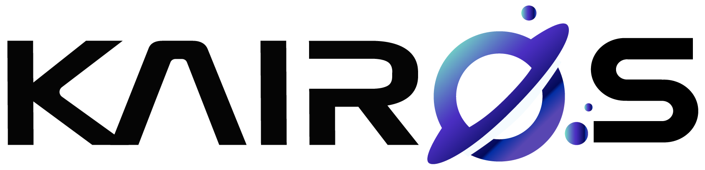
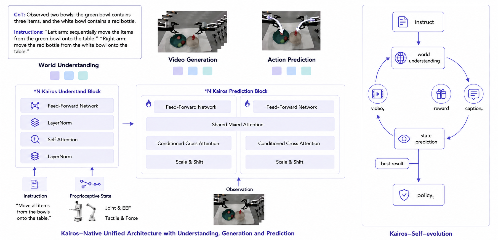
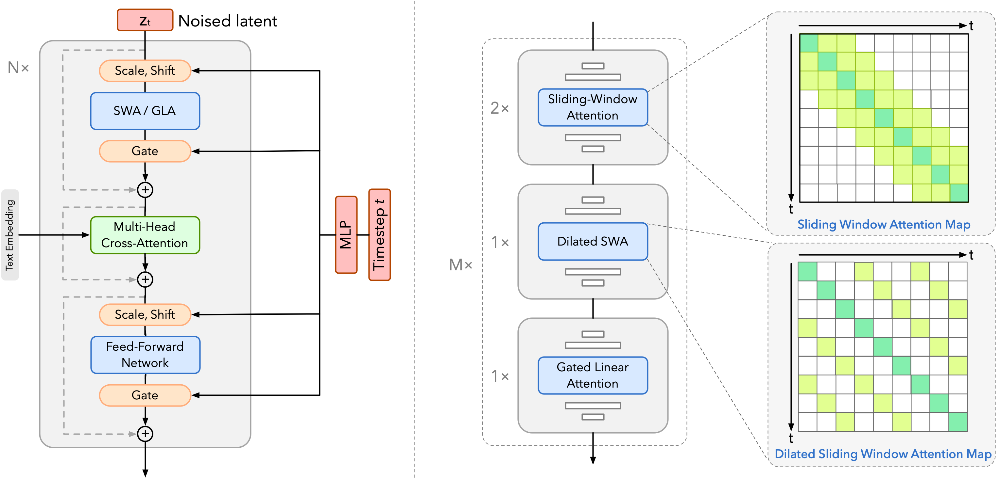
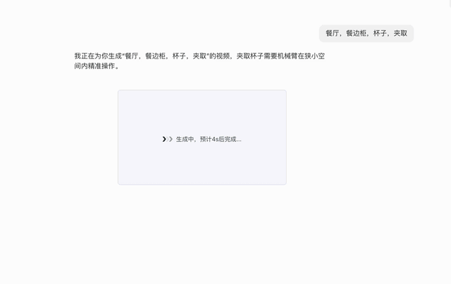
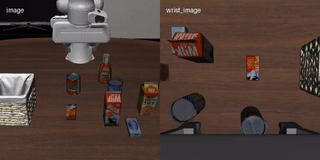
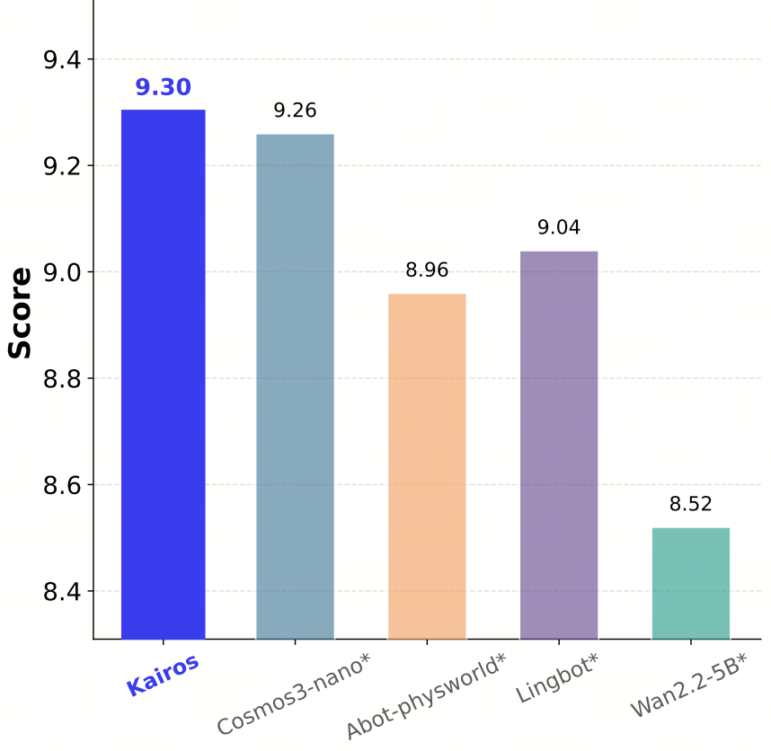
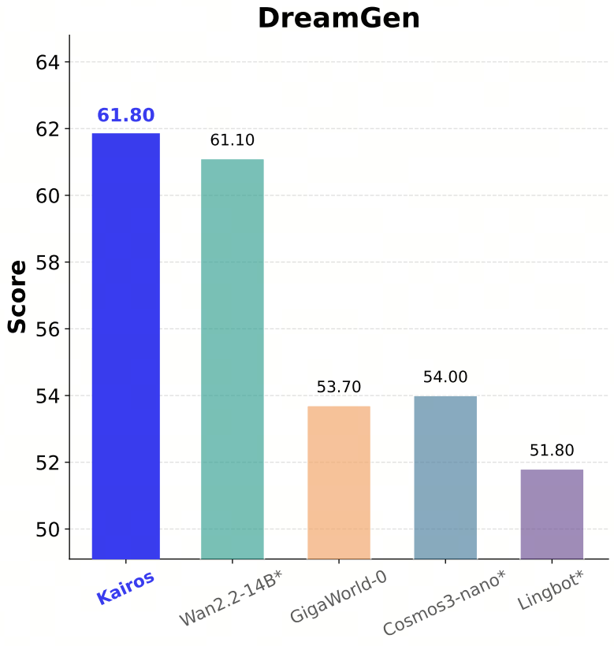
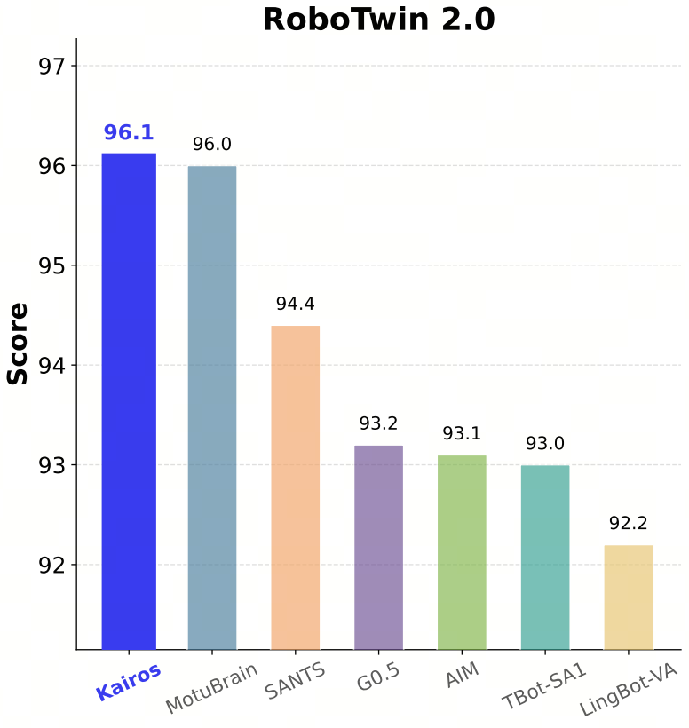
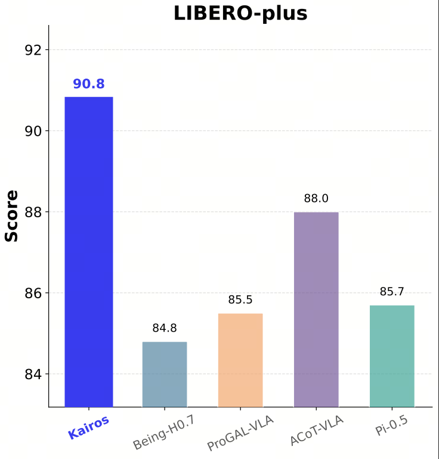

# Kairos

<p align="center">
    
</p>

<p align="center">
    💜 <a href="https://kairos.acerobotics.com">Kairos Platform</a> &nbsp&nbsp ｜ &nbsp&nbsp 🖥️ <a href="https://github.com/kairos-agi">GitHub</a> &nbsp&nbsp  | &nbsp&nbsp🤗 <a href="https://huggingface.co/collections/kairos-agi/kairos30">Hugging Face</a>&nbsp&nbsp | &nbsp&nbsp🤖 <a href="https://modelscope.cn/collections/kairos-team/kairos30">Model Scope</a>&nbsp&nbsp| &nbsp&nbsp 📑 <a href="https://arxiv.org/abs/2606.16533">Paper</a> &nbsp&nbsp 
</p>

-----
**Kairos** is a 4B-parameter native cross-embodiment world model for unified understanding, generation, and action prediction. Through a progressive Cross-Embodiment Data Curriculum, it learns from general videos, human behavior, and real-robot interaction to build persistent world representations. Powered by a World-Action Model architecture and hybrid linear temporal memory, Kairos jointly predicts future visual states and executable robot actions, enabling long-horizon reasoning, high-quality generation, and real-time edge-side deployment for embodied AI.

## 🔥 0. Latest News

Jul 2, 2026: 🛠️ We've open-sourced the Kairos3.1 series, including World-Action Model inference code and three model weights: [Kairos3.1-4B-robot-480P](https://huggingface.co/kairos-agi/Kairos3.1-4B-robot-480P), [kairos-4B-robot-RoboTwin2.0](https://huggingface.co/kairos-agi/kairos-4B-robot-RoboTwin2.0), and [kairos-4B-robot-LIBERO-plus](https://huggingface.co/kairos-agi/kairos-4B-robot-LIBERO-plus). RoboTwin 2.0 and LIBERO-Plus support executable action prediction.

Jun 16, 2026: 📄 We've released the Kairos technical report on arXiv: [Kairos Technical Report](https://arxiv.org/abs/2606.16533).

Feb 26, 2026: 👋 We've released Kairos video world model weights, including [kairos-robot-4B-480P](https://huggingface.co/kairos-agi/kairos-sensenova-robot-4B-480P), [kairos-robot-4B-480P-distilled](https://huggingface.co/kairos-agi/kairos-sensenova-robot-4B-480P-distilled), and [kairos-4B-720P](https://huggingface.co/kairos-agi/kairos-sensenova-4B-720P).

Dec 18, 2025: 🎉 Kairos 3.0 was officially introduced, along with the Kairos World Model inference code and [kairos-4B-480P-pretrained](https://huggingface.co/kairos-agi/kairos-sensenova-4B-480P-pretrained).


## 🚀 1. Motivation
Embodied AI is entering the era of Scaling Laws, yet scaling alone cannot overcome the core barriers to reliable real-world interaction. Heterogeneous embodiment data, weak long-horizon reasoning, separated video-and-action modeling, and edge-side compute constraints still limit the practicality of current world models. Kairos addresses these challenges by unifying cross-embodiment pretraining, persistent world-state modeling, future generation, and executable action prediction within an efficient deployment-aware framework.


## 🌟 2. Kairos Framework

<div align="center">
<table align="center">
    <tr>
        <td align="center"></td>
        <td align="center"></td>
        <td align="center"></td>
    </tr>
</table>
</div>

### 🌍 Native Pretraining Paradigm with Cross-Embodiment Data Curriculum
Kairos introduces a native world-model pretraining paradigm that learns physical, behavioral, and embodied knowledge from scratch, rather than relying on decoupled post-training adaptation. Through a Cross-Embodiment Data Curriculum (CEDC), the model progressively absorbs knowledge from general videos, human behavior data, and real-robot interaction data. This curriculum enables Kairos to move beyond flat data scaling, building world representations that evolve from passive physical understanding to active task intent and embodied control.

### 🔗 Unified Understanding–Generation–Prediction Architecture
Kairos is designed as a native end-to-end architecture for understanding, generating, and predicting the world within a unified Mixture-of-Transformers framework. Instead of treating world modeling as simple video continuation, Kairos maintains persistent world states, where understanding provides causal interpretation, generation unfolds plausible futures, and prediction produces executable robot actions. This unified design allows the model to connect perception, reasoning, planning, and action in a single intelligence loop.

### ⚡ Hybrid Linear Temporal Memory for Efficient Deployment
Kairos introduces a hybrid linear temporal memory mechanism for long-horizon world modeling. By combining Sliding-Window Attention, Dilated Sliding-Window Attention, and Gated Linear Attention, the model captures local dynamics, mid-range interactions, and global causal memory under linear-complexity temporal modeling. Together with deployment-aware system co-design, including efficient kernels, quantization, and token streaming, Kairos supports low-memory, high-throughput inference and lays the foundation for real-time closed-loop deployment.

## ✨ 3. Demos
<div align="center">
<table style="text-align: center; margin: 0 auto;">
    <thead>
        <tr>
            <th style="text-align: center;">Physical–causal consistency</th>
            <th style="text-align: center;">Cross-embodiment generalization</th>
             <th style="text-align: center;"> Accurate Action Prediction </th>
            <th style="text-align: center;">High-efficiency inference</th>
        </tr>
    </thead>
    <tbody>
            <tr>
            <td style="text-align: center;"></td>
            <td style="text-align: center;"></td>
            <td style="text-align: center;"></td>
            <td style="text-align: center;" rowspan="3"></td>
        </tr>
        <tr>
            <td style="text-align: center;"></td>
            <td style="text-align: center;"></td>
            <td style="text-align: center;"></td>
        </tr>
        <tr>
            <td style="text-align: center;"></td>
            <td style="text-align: center;"></td>
            <td style="text-align: center;"></td>
        </tr>
    </tbody>
</table>
</div>

#### 🧠 Physical–causal consistency
Kairos leverages causal CoT and physical laws to transform multimodal inputs into deep task logic. It enables autonomous planning and feasibility analysis, shifting the system from "executing commands" to "understanding intent" for real-world robotic actions.
#### 🎨 Cross-embodiment generalization
Unified Cross-Embodiment Generation: A single "brain" that generalizes across single-arm, dual-arm, and dexterous-hand platforms. Kairos enables shared, transferable world knowledge with maximal adaptability. Broad Hardware Support: Native compatibility with Agibot G1, Unitree G1, and Songling PIPER, significantly slashing development costs through zero-shot multi-task generalization.
#### 🎯 Accurate Action Prediction
Powered by its World-Action Model, Kairos predicts executable robot action trajectories directly from visual observations and task context. This enables accurate, temporally coherent, and physically grounded action generation for long-horizon embodied manipulation.
#### 🔮 High-efficiency inference
Real-time Edge Performance: Industry-leading inference speed with ultra-low resource consumption. Optimized for low-latency, high-reliability deployment across single or multi-GPU embodied systems.


## 📦 4. Model Zoo
| Download Links | Model Version | Highlights |
|:---:|:---:|:---:|
| 🤗[HuggingFace](https://huggingface.co/kairos-agi/Kairos3.1-4B-robot-480P) 🤖[ModelScope](https://www.modelscope.cn/models/kairos-team/Kairos3.1-4B-robot-480P) | kairos3.1-4B-robot-480P |   Embodied foundation model for generation |
| 🤗[HuggingFace](https://huggingface.co/kairos-agi/kairos-4B-robot-RoboTwin2.0) 🤖[ModelScope](https://www.modelscope.cn/models/kairos-team/kairos-4B-robot-RoboTwin2.0)| kairos3.1-4B-robot-RoboTwin2.0 | SOTA performance on 50+ bimanual RoboTwin2.0 tasks|
| 🤗[HuggingFace](https://huggingface.co/kairos-agi/kairos-4B-robot-LIBERO-plus) 🤖[ModelScope](https://www.modelscope.cn/models/kairos-team/kairos-4B-robot-LIBERO-plus)| kairos3.1-4B-robot-LIBERO-plus | SOTA performance on LIBERO-plus |
| 🤗[HuggingFace](https://huggingface.co/kairos-agi/kairos-sensenova-4B-720P) 🤖[ModelScope](https://modelscope.cn/models/kairos-team/kairos-sensenova-4B-720P)| kairos-4B-720P | Supports 720P HD output with enhanced fine-grained detail capture |


## 📈 5. Evaluation 
### 🎯 5.1 Accuracy Benchmarks

<div align="center">
<table align="center">
    <tr>
        <!-- 左边一列 -->
        <td align="center">
        <br>
        </td>
        <!-- 右边一列 -->
        <td align="center">
        <br>
        </td>
    </tr>
    <tr>
        <td colspan="2" align="center">
        <strong>Performance comparison across embodied world model benchmarks</strong>
        </td>
    </tr>
</table>
</div>


<div align="center">
<table align="center">
    <tr>
        <!-- 左边一列 -->
        <td align="center">
        <br>
        </td>
        <!-- 右边一列 -->
        <td align="center">
        <br>
        </td>
    </tr>
    <tr>
        <td colspan="2" align="center">
        <strong>Performance comparison across world action model benchmarks</strong>
        </td>
    </tr>
</table>
</div>

### ⚡ 5.2 Deployment
#### 5.2.1 Real-time Inference

| GPU | Resolution | Memory(GB) | 1 GPU (s) | 4 GPUs (s) |
|:---:|:---:|:---:|:---:|:---:|
| NV-A800 | 480P | 23.5 | 11.7 | 3.0 |
| NV-RTX5090 | 480P | 13.9 | 11.4 | 5.7 |

*(results based on kairos-4B-robot 480p distillation)

#### 5.2.2 Benchmark for A800 GPU


| Model | Parameters | Memory (GB) | Complexity (PFLOPs) | 1 GPU (s) | 4 GPUs (s) |
|:---:|:---:|:---:|:---:|:---:|:---:|
| Kairos | 4B | 23.5 | 2.3 | 43.3 | 9.5 |
| Cosmos 2.5 | 14B | 70.2 | 156.5 (~70x) | 2526.0 | 687.2 |
| Wan 2.2 | 5B | 23.4 | 16.6 (~7x) | 201.0 | 85.0 |
| Lingbot | 28B | 46.1 | 347.4 (~160x) | 5525.0 | 1436.0 |

*（evaluation setting：TI2V mode with 720P/5s）

## 🔧 6. Quick Start
### 6.1 Environment Installation

```bash
# Clone the repository
git clone https://github.com/kairos-agi/kairos-sensenova.git
cd kairos-sensenova

# You can set up the environment in two ways:
# 1) Build container from the Docker image
# 2) Build the environment from requirements with conda or venv

# 1) Docker image:
# Note:
# Please select the Docker image that matches your GPU platform.
# The default image is for A800 / A100, while RTX 5090 requires the -rtx5090 image tag, and METAX C500 requires the -metax tag.

# Pull the Docker image
# For A800 / A100
echo "$GHCR_TOKEN" | docker login ghcr.io -u username --password-stdin
docker pull ghcr.io/kairos-agi/kairos-sensenova:v0.0.1

# For RTX 5090
# docker pull ghcr.io/kairos-agi/kairos-sensenova:v0.0.1-rtx5090

# For METAX C500
# docker pull ghcr.io/kairos-agi/kairos-sensenova:v0.0.1-metax

# Create a container using Docker
docker run --rm -it \
  --gpus all \
  -v $(pwd):/workspace \
  ghcr.io/kairos-agi/kairos-sensenova:v0.0.1 \
  bash

# For RTX 5090
# docker run --rm -it \
#   --gpus all \
#   -v $(pwd):/workspace \
#   ghcr.io/kairos-agi/kairos-sensenova:v0.0.1-rtx5090 \
#   bash

# For METAX C500
# docker run --rm -it \
#   --gpus all \
#   -v $(pwd):/workspace \
#   ghcr.io/kairos-agi/kairos-sensenova:v0.0.1-metax \
#   bash

# 2) Requirements
# build a python environment with python>=3.10, torch>=2.6, and cuda>=12.6
# install requirements
# Note: METAX C500 is not supported in this setup method. For METAX C500, please use the Docker image only.
pip install -r requirements.txt
```

### 6.2 Download Kairos Models

- Download with huggingface
```bash
pip install -U huggingface_hub 

# 4B-480P
hf download kairos-agi/Kairos3.1-4B-robot-480P \
  --local-dir models/Kairos-model/kairos-agi/Kairos3.1-4B-robot-480P

# 4B-720P
hf download kairos-agi/kairos-sensenova-4B-720P \
  --local-dir models/Kairos-model/kairos-agi/kairos-sensenova-4B-720P 

# 4B-robot-RoboTwin2.0
hf download kairos-agi/kairos-4B-robot-RoboTwin2.0 \
  --local-dir models/Kairos-model/kairos-agi/kairos-4B-robot-RoboTwin2.0

# 4B-robot-LIBERO-plus
hf download kairos-agi/kairos-4B-robot-LIBERO-plus \
  --local-dir models/Kairos-model/kairos-agi/kairos-4B-robot-LIBERO-plus

```
- Download with modelscope
```bash
pip install modelscope

# 4B-480P
modelscope download kairos-team/Kairos3.1-4B-robot-480P \
  --local_dir models/Kairos-model/kairos-agi/kairos-team/Kairos3.1-4B-robot-480P 

# 4B-720P
modelscope download kairos-team/kairos-sensenova-4B-720P \
  --local_dir models/Kairos-model/kairos-agi/kairos-sensenova-4B-720P 

# 4B-robot-RoboTwin2.0
modelscope download kairos-team/kairos-4B-robot-RoboTwin2.0 \
  --local_dir models/Kairos-model/kairos-agi/kairos-4B-robot-RoboTwin2.0

# 4B-robot-LIBERO-plus
modelscope download kairos-team/kairos-4B-robot-LIBERO-plus \
  --local_dir models/Kairos-model/kairos-agi/kairos-4B-robot-LIBERO-plus

```
### 6.3 Run Inference
```bash
# Note: Please complete Section 6.2 first to download the Kairos model weights.

# Step1: Download additional dependencies for inference
mkdir -p models/Qwen models/Wan2.1-T2V-14B

# Download Qwen2.5-VL for Text-Encoder
hf download Qwen/Qwen2.5-VL-7B-Instruct-AWQ \
  --local-dir models/Qwen/Qwen2.5-VL-7B-Instruct-AWQ \
  --include "*.safetensors"  

hf download Qwen/Qwen3.5-2B \
  --local-dir models/Qwen/Qwen3.5-2B

# Download Wan2.1-VAE for VAE-Encoder/Decoder
hf download Wan-AI/Wan2.1-T2V-14B \
  --local-dir models/Wan2.1-T2V-14B \
  --include "Wan2.1_VAE.pth"  

# Step2: Run the examples
# The example JSON files provided here are intended for the
# `kairos-sensenova-robot-4B-480P-distilled` model.
#
# For TI2V and I2V, please use the 480P JSON configs. This distilled model is
# optimized for 480P, and its performance at 720P is not ideal.
#
# For other models and the matching configs, please refer to `docs/QUICKSTART.md`.

# kairos-4B-720p
# Text2Video
bash examples/inference.sh examples/example_t2v.json kairos/configs/kairos_4b_config.py
# Text&FirstImage2Video
bash examples/inference.sh examples/example_ti2v.json kairos/configs/kairos_4b_config.py
# FirstImage2Video
bash examples/inference.sh examples/example_i2v.json kairos/configs/kairos_4b_config.py

# kairos-team/Kairos3.1-4B-robot-480P
# Text&FirstImage2Video
bash examples/inference.sh examples/example_ti2v_480P_robot_1.json kairos/configs/kairos_4b_video_only_config.py
bash examples/inference.sh examples/example_ti2v_480P_robot_2.json kairos/configs/kairos_4b_video_only_config.py

```

### 6.4 Run Inference in Simulation Environments

We provide benchmark-specific instructions and evaluation scripts for the following embodied AI benchmarks.

| Benchmark    | Description                                                                                         | Guide                                                      |
| ------------ | ---------------------------------------------------------------------------- | ---------------------------------------------------------- |
| RoboTwin 2.0 | Dual-arm manipulation benchmark for evaluating long-horizon embodied control and action prediction. | [benchmarks/robotwin](benchmarks/robotwin/README.md)       |
| LIBERO-Plus  | Long-horizon manipulation benchmark for evaluating generalization across tasks and scenes.          | [benchmarks/libero_plus](benchmarks/libero_plus/README.md) |

## 👥 7. About Us
Developed and maintained by the Kairos Team. We specialize in Embodied Intelligence and World Model research, with a mission to build Artificial General Intelligence (AGI) that truly understands the physical world. Our goal is to accelerate the industrialization of embodied technologies and reshape the global landscape of AI competition.
## 📄 8. License
Kairos is open-sourced under the Apache License 2.0. Feel free to use, modify, and build commercial products on top of it. Check the [LICENSE](LICENSE)  file for the full text.

## 📚 9. Citation
If you find our work helpful, please cite us.

```
@misc{kairosteam2026kairosnativeworldmodel,
      title={Kairos: A Native World Model Stack for Physical AI}, 
      author={Kairos Team and Fei Wang and Shan You and Qiming Zhang and Tao Huang and Zuoyi Fu and Zhisheng Zheng and Yunlong Xi and Feng Lv and Xiaoming Wu and Zeyu Liu and Cong Wan and Pu Li and Ruiqing Yang and Xiaoou Li and Wei Wang and Kangkang Zhu and Yuwei Zhang and Shi Fu and Zheng Zhang and Xiaoning Wu and Xuzeng Fan and Dacheng Tao and Xiaogang Wang},
      year={2026},
      eprint={2606.16533},
      archivePrefix={arXiv},
      primaryClass={cs.AI},
      url={https://arxiv.org/abs/2606.16533}, 
}
```

## 🙏 10. Acknowledgements

We would like to thank the contributors to [Qwen-Image](https://huggingface.co/Qwen/Qwen-Image), [Wan2.1](https://github.com/Wan-Video/Wan2.1), [DiffSynth-Studio](https://github.com/modelscope/DiffSynth-Studio), [FastWAM](https://github.com/yuantianyuan01/FastWAM) and [HuggingFace](https://huggingface.co) for their open-source research contributions.

---
⭐ Star us on GitHub if you find [Kairos](https://github.com/kairos-agi/kairos-sensenova) helpful!


